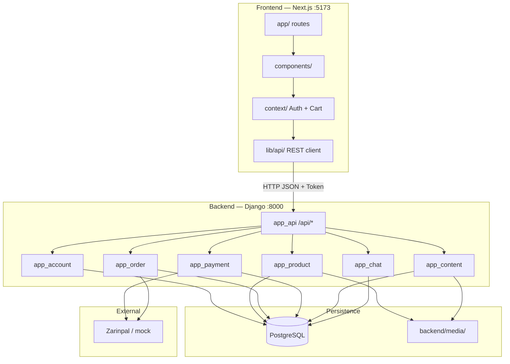
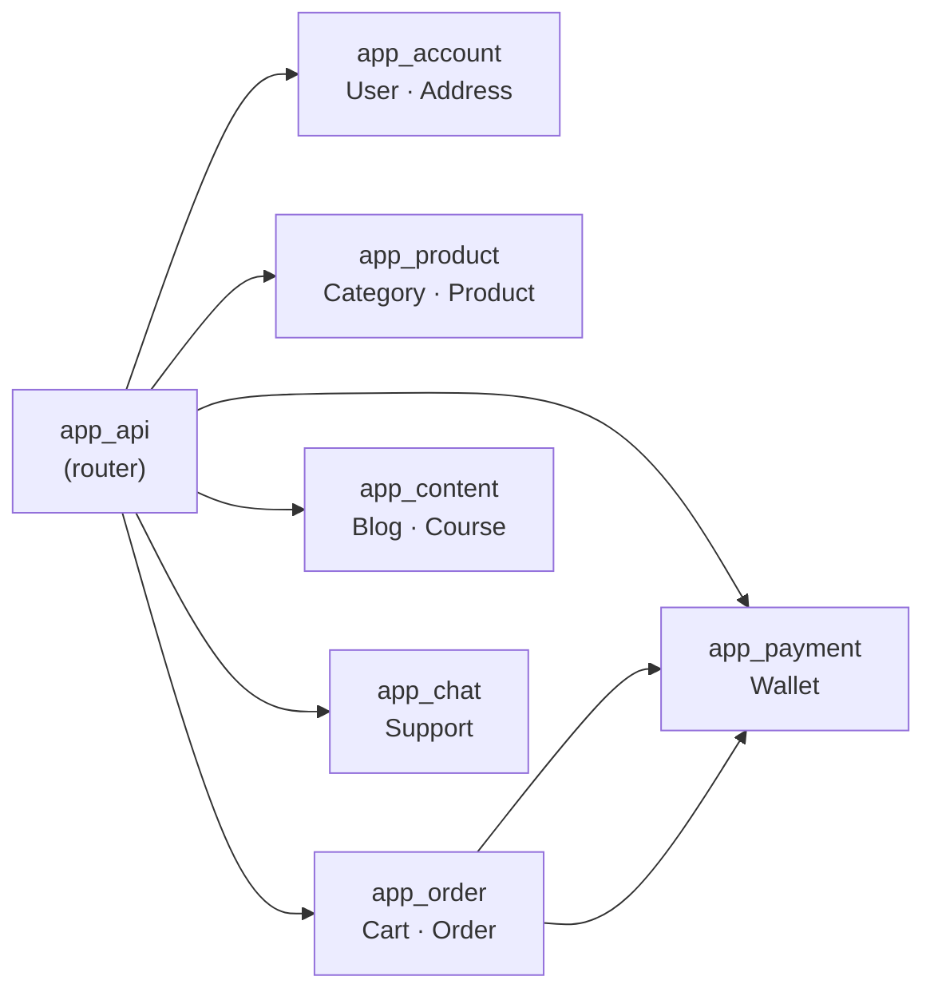
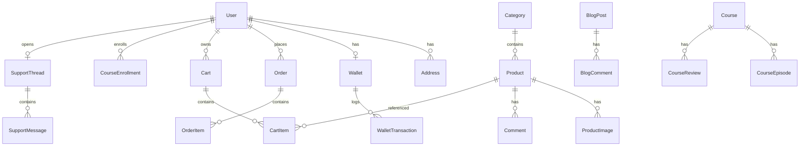

# Project structure

High-level map of the Sweats E-commerce repository.

## Repository tree

```
Sweats_E_commerce/
│
├── README.md                 # Project overview & quick start
├── requirements.txt          # → backend/requirements.txt
├── start-all-dev.cmd         # Launch API + frontend
├── .gitignore
├── .venv/                    # Python virtualenv (gitignored)
│
├── backend/                  # Django 6 REST API
│   ├── manage.py
│   ├── requirements.txt
│   ├── .env.example
│   ├── db.sqlite3            # Legacy — gitignored, not used
│   ├── config/               # Project settings & root URLs
│   │   ├── settings.py
│   │   ├── urls.py           # /admin/, /api/
│   │   └── utils/            # images, frontend redirects
│   │
│   ├── app_api/              # Central API router (/api/*)
│   ├── app_account/          # Users, addresses, auth
│   ├── app_product/          # Catalog, comments
│   ├── app_order/            # Cart, checkout, orders
│   ├── app_payment/          # Wallet, Zarinpal gateway
│   ├── app_content/          # Blog, courses, tutorials
│   ├── app_chat/             # Support & contact
│   ├── app_shipping/         # (stub)
│   ├── app_reporting/        # (stub)
│   ├── app_analytics/        # (stub)
│   └── app_main/             # (stub)
│
├── frontend/                 # Next.js 16 App Router
│   ├── package.json
│   ├── next.config.ts
│   └── src/
│       ├── app/              # Routes (pages)
│       ├── components/       # UI components
│       ├── context/          # Auth & cart state
│       ├── content/          # Static page copy (about, faq, …)
│       ├── lib/              # API client, constants, i18n, utils
│       └── types/            # TypeScript API types
│
├── scripts/
│   ├── django.cmd            # Run manage.py in venv
│   ├── setup-postgres.cmd    # Create DB + migrate
│   ├── setup_postgres.py
│   ├── seed-dummy-data.cmd
│   ├── seed_dummy_data.py
│   ├── create_superuser.py
│   └── helper/               # Git Flow CMD helpers
│
├── docs/                     # Developer documentation (this folder)
├── plan/                     # Local planning notes (mostly gitignored)
└── Dataset/                  # Local datasets (optional)
```

## System diagram



## Backend app map



## Frontend routes

| Route | Page |
|-------|------|
| `/` | Home |
| `/products`, `/products/[slug]` | Shop |
| `/cart`, `/checkout`, `/orders` | Commerce |
| `/wallet`, `/profile` | Account |
| `/auth/login`, `/auth/register` | Auth |
| `/blog`, `/blog/[slug]` | Blog |
| `/courses`, `/courses/[slug]`, `.../watch/[episodeSlug]` | Courses |
| `/tutorials`, `/tutorials/[slug]/watch` | Tutorials |
| `/about`, `/contact`, `/faq` | Static |

Route constants: `frontend/src/lib/constants/routes.ts`.

## Data model (simplified)



## Conventions

- **Backend:** one Django app per business domain; serializers + class-based API views
- **Frontend:** thin `page.tsx` + `*PageClient.tsx` for interactive pages
- **API paths:** trailing slashes (Django default)
- **Locale:** Persian UI, `Asia/Tehran` timezone, Toman currency in API
